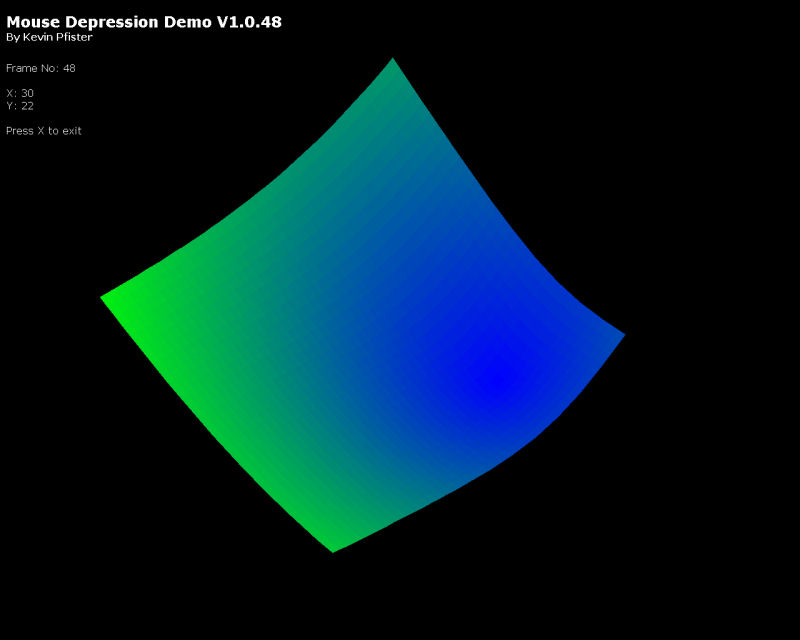



## Mouse Movement Demo

### Description

This is a demo I made for a friends tablet PC to show off the tilt feature allowing for mouse movement. However this can be used on any pc. It creates a surface that can be deformed by the mouse and is a really cool effect, just move the mouse on the surface and watch what happens.
 
### More Info
 

             |
---                |---
**Submitted On**   |2006-06-11 14:20:02
**By**             |[Kevin Pfister](https://github.com/Planet-Source-Code/PSCIndex/blob/master/ByAuthor/kevin-pfister.md)
**Level**          |Beginner
**User Rating**    |4.7 (14 globes from 3 users)
**Compatibility**  |VB 6\.0
**Category**       |[Graphics](https://github.com/Planet-Source-Code/PSCIndex/blob/master/ByCategory/graphics__1-46.md)
**World**          |[Visual Basic](https://github.com/Planet-Source-Code/PSCIndex/blob/master/ByWorld/visual-basic.md)
**Archive File**   |[Mouse\_Move2000166112006\.zip](https://github.com/Planet-Source-Code/kevin-pfister-mouse-movement-demo__1-65639/archive/master.zip)

